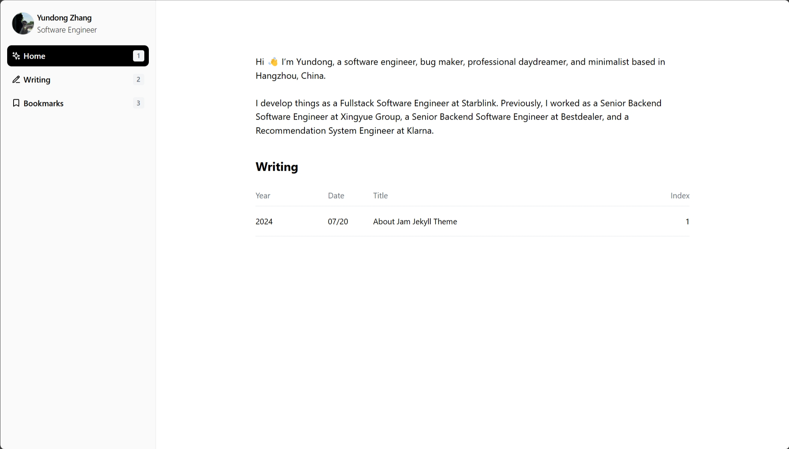
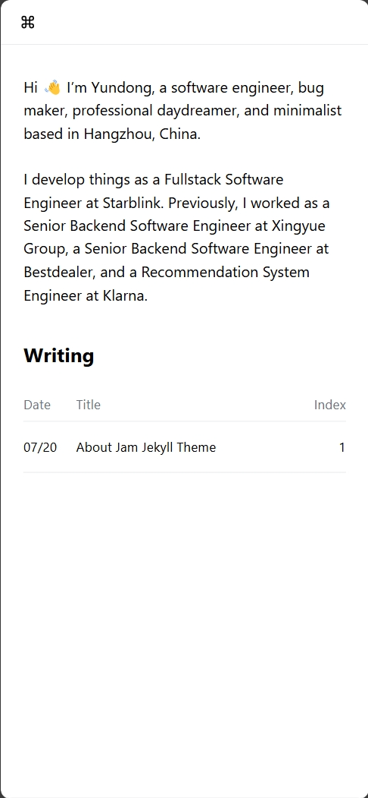
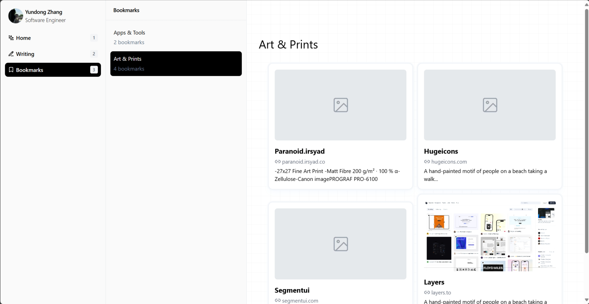

# Jam is a refreshing and simple Jekyll theme.
> Supports both mobile and PC devices
> 

# How to use

## Pages
### Home
You can adjust your profile in _config.yml 
Default homepage only displays 5 items of posts, But you can modify it in home.html.(search keyword <b>limit : 5</b>) 

### Writhing
The file in markdown format, remember to put it in the _posts folder

### Bookmarks
You can use it as a bookmark.

## Files
All files are stored in the <b>assets</b> directory

# Demo
<a href="https://isyundong.com"> Demo </a>