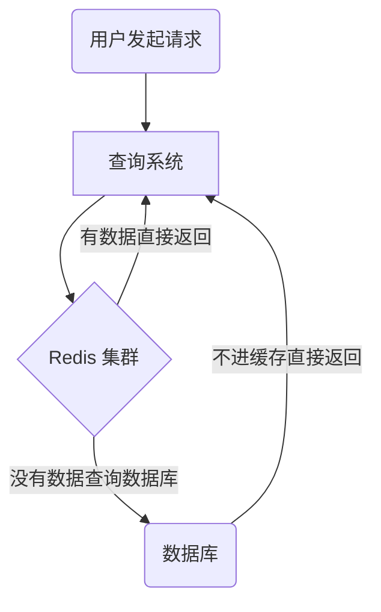
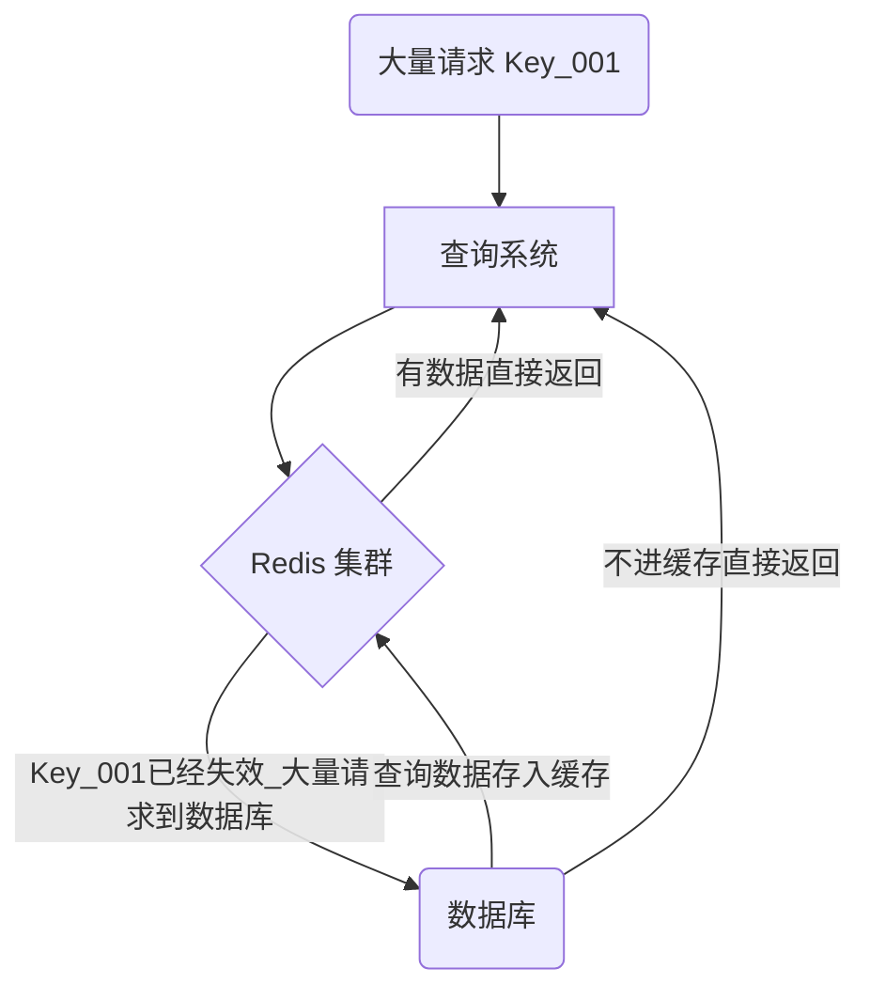
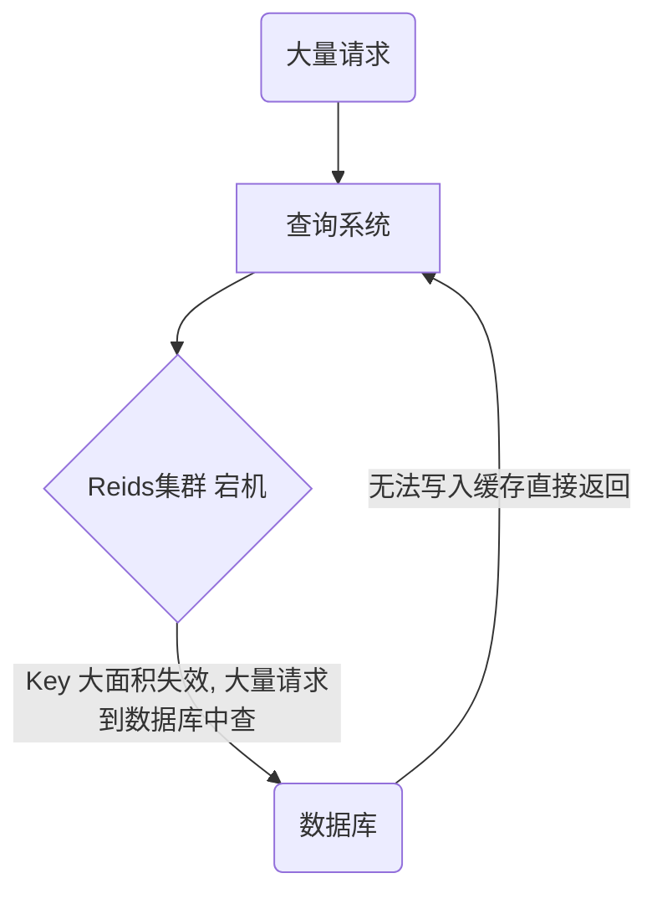

<!-- more -->

### 缓存穿透

> 缓存穿透：缓存和数据库中都没有的数据，可用户还是源源不断的发起请求，导致每次请求都会到数据库，从而压垮数据库。
> 
> 例如: 客户查询一个根本不存在的东西，首先从Redis中查不到，然后会去数据库中查询，数据库中也查询不到，那么就不会将数据放入到缓存中，后面如果还有类似源源不断的请求，最后都会压到数据库来处理，从而给数据库造成巨大的压力。

**解决办法**

1. 用户发过来的请求，根据请求参数进行校验，对于明显错误的参数，直接拦截返回。
   比如，请求参数为主键自增id，那么对于请求小于0的id参数，明显不符合，可以直接返回错误请求。

2. 不存在数据设置短过期时间
   对于某个查询为空的数据，可以将这个空结果进行Redis缓存，但是设置很短的过期时间，比如30s，可以根据实际业务设定。注意一定不要影响正常业务。

3. 布隆过滤器
   布隆过滤器是一种数据结构，利用极小的内存，可以判断大量的数据 **一定不存在或者可能存在**。对于缓存击穿，我们可以将查询的数据条件都哈希到一个足够大的布隆过滤器中，用户发送的请求会先被布隆过滤器拦截，一定不存在的数据就直接拦截返回了，从而避免下一步对数据库的压力。

### 缓存击穿

> 缓存击穿：Redis中一个热点key在失效的同时，大量的请求过来，从而会全部到达数据库，压垮数据库。

**解决办法**

1. 设置热点数据永
   不过期对于某个需要频繁获取的信息，缓存在Redis中，并设置其永不过期。当然这种方式比较粗暴，对于某些业务场景是不适合的。

2. 定时更新
   比如这个热点数据的过期时间是1h，那么每到59minutes时，通过定时任务去更新这个热点key，并重新设置其过期时间。

3. 互斥锁
   这是解决缓存穿透比较常用的方法。
   互斥锁简单来说就是在Redis中根据key获得的value值为空时，先锁上，然后从数据库加载，加载完毕，释放锁。若其他线程也在请求该key时，发现获取锁失败，则睡眠一段时间（比如100ms）后重试。
   
   

### 缓存雪崩

> 缓存雪崩：Redis中缓存的数据大面积同时失效，或者Redis宕机，从而会导致大量请求直接到数据库，压垮数据库。

**解决办法**

1. 设置有效期均匀分布
   避免缓存设置相近的有效期，我们可以在设置有效期时增加随机值；
   
   或者统一规划有效期，使得过期时间均匀分布。
2. 数据预热
   
   对于即将来临的大量请求，我们可以提前走一遍系统，将数据提前缓存在Redis中，并设置不同的过期时间。
3. 保证Redis服务高可用

