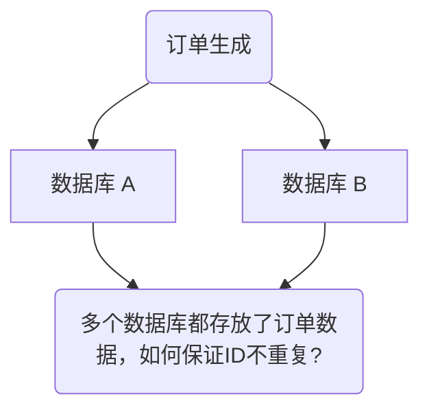

<!-- more -->

### 分布式 ID 介绍

#### 什么是ID？

日常开发中，我们需要对系统中的各种数据使用 ID 唯一表示，比如用户 ID 对应且仅对应一个人，商品 ID 对应且仅对应一件商品，订单 ID 对应且仅对应一个订单。

我们现实生活中也有各种 ID，比如身份证 ID 对应且仅对应一个人、地址 ID 对应且仅对应

简单来说，**ID 就是数据的唯一标识**。

#### 什么是分布式 ID？

分布式 ID 是分布式系统下的 ID。分布式 ID 不存在与现实生活中，属于计算机系统中的一个概念。

我简单举一个分库分表的例子。

我司的一个项目，使用的是单机 MySQL 。但是，没想到的是，项目上线一个月之后，随着使用人数越来越多，整个系统的数据量将越来越大。单机 MySQL 已经没办法支撑了，需要进行分库分表（推荐 Sharding-JDBC）。

在分库之后， 数据遍布在不同服务器上的数据库，数据库的自增主键已经没办法满足生成的主键唯一了。**我们如何为不同的数据节点生成全局唯一主键呢？**

这个时候就需要生成**分布式 ID**了。



#### 分布式 ID 需要满足哪些要求?


一个最基本的分布式 ID 需要满足下面这些要求：

- **全局唯一**：ID 的全局唯一性肯定是首先要满足的！
- **高性能**：分布式 ID 的生成速度要快，对本地资源消耗要小。
- **高可用**：生成分布式 ID 的服务要保证可用性无限接近于 100%。
- **方便易用**：拿来即用，使用方便，快速接入！

- **安全**：ID 中不包含敏感信息。

### 分布式 ID 常见解决方案

1. 利用一些中间件

   > 缺点：如何存储的是订单ID，竞争对手很容易就推算出我们的每日订单数。**不够安全**，而且强依赖中间件

   - 使用 Mysql 可以设置 ID 自增特点生产 ID 

     > `stub` 字段无意义，只是为了占位，便于我们插入或者修改数据。并且，给 `stub` 字段创建了唯一索引，保证其唯一性。
     ```sql
     CREATE TABLE `sequence_id` (
       `id` bigint(20) unsigned NOT NULL AUTO_INCREMENT,
       `stub` char(10) NOT NULL DEFAULT '',
       PRIMARY KEY (`id`),
       UNIQUE KEY `stub` (`stub`)
     ) ENGINE=InnoDB DEFAULT CHARSET=utf8mb4;
     ```

   - 利用 Redis 的 `incr` 命令即可实现对 id 原子顺序递增。
     ```bash
     127.0.0.1:6379> set sequence_id_biz_type 1
     OK
     127.0.0.1:6379> incr sequence_id_biz_type
     (integer) 2
     127.0.0.1:6379> get sequence_id_biz_type
     "2"
     ```

2. 通过算法

   - UUID

     > 优点：生成速度比较快、简单易用
     >
     > 缺点**：存储消耗空间大（32 个字符串，128 位）、 不安全（**基于 MAC 地址生成 UUID 的算法会造成 MAC 地址泄露**)、无序（非自增）、没有具体业务含义、需要解决重复 ID 问题（当机器时间不对的情况下，可能导致会产生重复 ID）

     - 5 种不同的 Version(版本)值分别对应的含义：
       - **版本 1** : UUID 是根据时间和节点 ID（通常是 MAC 地址）生成；
       - **版本 2** : UUID 是根据标识符（通常是组或用户 ID）、时间和节点 ID 生成；
       - **版本 3、版本 5** : 版本 5 - 确定性 UUID 通过散列（hashing）名字空间（namespace）标识符和名称生成；
       - **版本 4** : UUID 使用**随机性**或**伪随机性**生成。

   - Snowflake(雪花算法)

     > **优点**：生成速度比较快、生成的 ID 有序递增、比较灵活（可以对 Snowflake 算法进行简单的改造比如加入业务 ID）
     >
     > **缺点**：需要解决重复 ID 问题（ID 生成依赖时间，在获取时间的时候，可能会出现时间回拨的问题，也就是服务器上的时间突然倒退到之前的时间，进而导致会产生重复 ID）、依赖机器 ID 对分布式环境不友好（当需要自动启停或增减机器时，固定的机器 ID 可能不够灵活）。

     Snowflake 是 Twitter 开源的分布式 ID 生成算法。Snowflake 由 64 bit 的二进制数字组成，这 64bit 的二进制被分成了几部分，每一部分存储的数据都有特定的含义：
     

     - **sign(1bit)**:符号位（标识正负），始终为 0，代表生成的 ID 为正数。
     - **timestamp (41 bits)**:一共 41 位，用来表示时间戳，单位是毫秒，可以支撑 2 ^41 毫秒（约 69 年）
     - **datacenter id + worker id (10 bits)**:一般来说，前 5 位表示机房 ID，后 5 位表示机器 ID（实际项目中可以根据实际情况调整）。这样就可以区分不同集群/机房的节点。
     - **sequence (12 bits)**:一共 12 位，用来表示序列号。序列号为自增值，代表单台机器每毫秒能够产生的最大 ID 数(2^12 = 4096),也就是说单台机器每毫秒最多可以生成 4096 个 唯一 ID。

